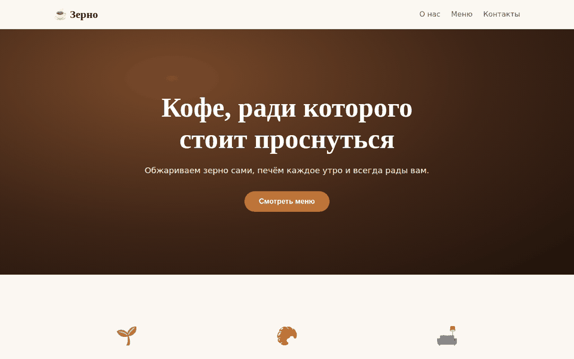
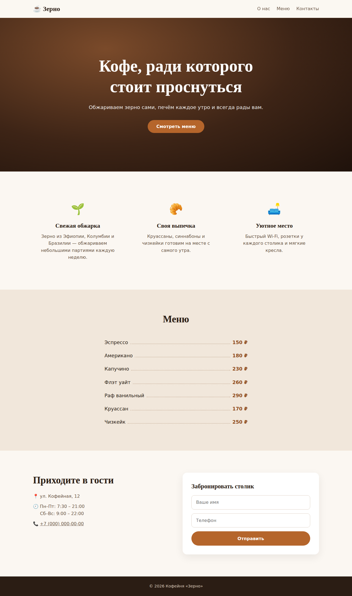
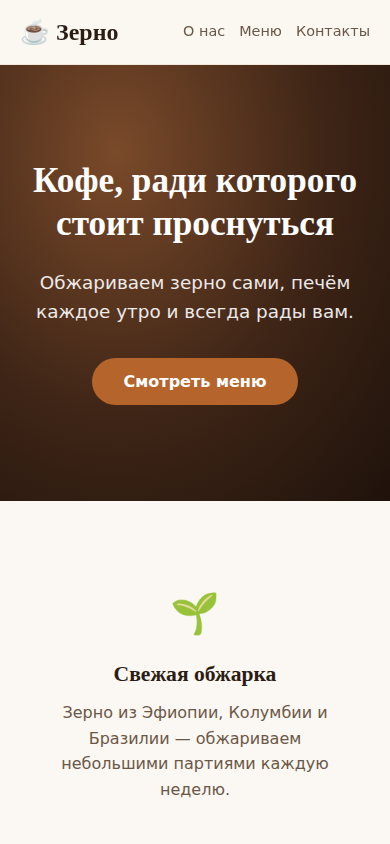

<div align="center">

# ☕ Кофейня «Зерно» — лендинг

**Адаптивный одностраничный сайт кофейни: меню, преимущества, контакты и бронирование столика**

[](https://yaki-gl.github.io/coffee-landing/)


### [▶ Открыть демо](https://yaki-gl.github.io/coffee-landing/)



</div>

---

## 📌 Содержание

- [О проекте](#-о-проекте)
- [Для кого и зачем](#-для-кого-и-зачем)
- [Структура страницы](#-структура-страницы)
- [Возможности](#-возможности)
- [Скриншоты](#-скриншоты)
- [Стек технологий](#-стек-технологий)
- [Быстрый старт](#-быстрый-старт)
- [Структура проекта](#-структура-проекта)
- [Архитектура](#-архитектура)
- [Roadmap](#-roadmap)
- [Автор](#-автор)

---

## 💡 О проекте

**«Зерно»** — лендинг для небольшой городской кофейни. Его задача — за несколько секунд объяснить гостю, чем это место отличается, показать меню с ценами и дать способ прийти: адрес, часы работы и форма брони столика.

Кофейня вымышленная, но структура и тексты основаны на моём опыте работы в HoReCa с 2022 года: от бариста до управляющего точкой. Я знаю, что гости спрашивают чаще всего, и вынес это на первый экран.

## 🎯 Для кого и зачем

| Кто | Какую задачу решает |
|---|---|
| **Владелец кофейни** | Получает быстрый и недорогой сайт, который можно запустить за день на бесплатном хостинге |
| **Гость** | С телефона за полминуты видит меню и цены, адрес и время работы и может забронировать столик |
| **Маркетолог** | Получает готовую страницу для ссылки из карт, соцсетей и QR-кода на столе |

## 🧭 Структура страницы

| Блок | Что в нём | Зачем |
|---|---|---|
| **Шапка** | Логотип, якорное меню (липкое при прокрутке) | Быстрая навигация по странице |
| **Hero** | Заголовок-оффер, подзаголовок, кнопка «Смотреть меню» | Первое впечатление и главное действие |
| **О нас** | 3 преимущества: обжарка, выпечка, атмосфера | Отличие от сетевых кофеен |
| **Меню** | Позиции с ценами в «ресторанном» стиле с точками | Ответ на главный вопрос гостя: сколько стоит |
| **Контакты** | Адрес, часы работы, телефон, форма брони | Превращает посетителя сайта в гостя |
| **Футер** | Копирайт | Завершение страницы |

## ✨ Возможности

- 📱 **Адаптивная вёрстка**: корректно выглядит на телефоне, планшете и десктопе
- 🧷 **Липкая навигация** с размытием фона (`backdrop-filter`)
- 🔗 **Плавная прокрутка** к разделам по якорям
- 📝 **Форма бронирования** с валидацией обязательных полей и сообщением об успехе
- 🎨 **Дизайн-токены** в CSS-переменных: цвета меняются в одном месте
- 🔍 **SEO-основа**: `lang`, `meta description`, семантические теги, favicon
- ⚡ **Лёгкая страница** без фреймворков, код разделён по секциям

## 🖼 Скриншоты

| Десктоп | Мобильная версия |
|---|---|
|  |  |

## 🛠 Стек технологий

| Слой | Технология | Для чего |
|---|---|---|
| Разметка | **HTML5** | Семантическая структура: `header`, `section`, `nav`, `form`, `footer` |
| Стили | **CSS3** (Grid, Flexbox, Custom Properties, `clamp()`) | Адаптивная сетка, резиновая типографика, цветовые токены |
| Интерактив | **Vanilla JavaScript (ES-модули)** | Обработка формы бронирования без перезагрузки страницы |
| Методология | **BEM** | Понятные имена классов и изоляция стилей блоков |
| Шрифты | **Google Fonts**: Playfair Display, Inter | Тёплый «кофейный» заголовочный шрифт и читаемый текст |
| Изображения | **Unsplash** | Фотография для главного экрана |
| Хостинг | **GitHub Pages** | Бесплатный статический хостинг |
| Разработка | **Claude (AI-ассистент)** | Вайбкодинг: генерация и доработка кода по моим требованиям |

## ⚡ Быстрый старт

Проект использует ES-модули, поэтому его нужно открывать через локальный сервер, а не двойным кликом по файлу.

```bash
# 1. Клонировать репозиторий
git clone https://github.com/YaKi-gl/coffee-landing.git
cd coffee-landing

# 2. Запустить локальный сервер (любой из вариантов)
npx serve .                 # Node.js
python3 -m http.server 8000 # Python

# 3. Открыть http://localhost:8000 (или адрес, который покажет serve)
```

Установка зависимостей не нужна.

## 📁 Структура проекта

```
coffee-landing/
├── index.html                  # разметка страницы (семантические секции)
├── css/
│   ├── variables.css           # дизайн-токены: палитра, шрифты, размеры
│   ├── base.css                # сброс, типографика, контейнер
│   ├── components.css          # кнопка, секция, форма
│   └── sections/               # стили каждого блока страницы отдельно
│       ├── nav.css
│       ├── hero.css
│       ├── features.css
│       ├── menu.css
│       ├── contacts.css
│       └── footer.css
├── js/
│   ├── main.js                 # точка входа
│   └── booking.js              # логика формы бронирования
├── docs/                       # демо и скриншоты для README
├── LICENSE
└── README.md
```

## 🏗 Архитектура

- **CSS по методологии BEM** (`block__element--modifier`): у каждого блока страницы свой файл в `css/sections/`, а общие токены и компоненты вынесены отдельно. Блок можно изменить, не задев остальные.
- **Дизайн-токены** в `variables.css`: цвета, шрифты и размеры меняются в одном месте.
- **JS на ES-модулях**: `booking.js` отвечает только за форму. Чтобы отправлять заявки в Telegram, достаточно заменить функцию `sendBooking`.

## 🗺 Roadmap

- [x] Адаптивная вёрстка всех блоков
- [x] Меню с ценами и форма бронирования
- [ ] Отправка заявок в Telegram-бота
- [ ] Карта с расположением кофейни
- [ ] Галерея интерьера и напитков
- [ ] Тёмная тема

## 🤖 Как сделано

Лендинг собран в формате **вайбкодинга** с AI-ассистентом. От меня: структура страницы, тексты, меню и цены, а также понимание, что важно гостю кофейни. Это мой опыт работы с гостями за стойкой.

## 👤 Автор

**Борис Фролов** — Release Manager, управляющий кофейней

[](https://github.com/YaKi-gl)

---

<div align="center">

⭐ Если проект показался полезным, поставьте звезду

</div>
